# 🌿 Automatização de Hortas Caseiras: Sistema Inteligente de Irrigação com Arduino

Este projeto tem como objetivo desenvolver um sistema automatizado de irrigação para hortas domésticas, utilizando sensores de umidade do solo, temperatura e umidade do ar, integrados a uma plataforma Arduino ESP32. Os dados são coletados e enviados para um sistema web e aplicativo mobile, permitindo o monitoramento em tempo real e promovendo o uso eficiente da água.

---

## 📖 Publicação Científica

Este trabalho foi publicado integralmente como artigo científico na **Revista Caderno Pedagógico**, reforçando sua relevância acadêmica e prática pedagógica.

🔗 DOI do artigo: [https://doi.org/10.54033/cadpedv22n8-326]()

---

## 🖥️ Imagens do Site

Interface web responsiva para visualização dos dados dos sensores:

  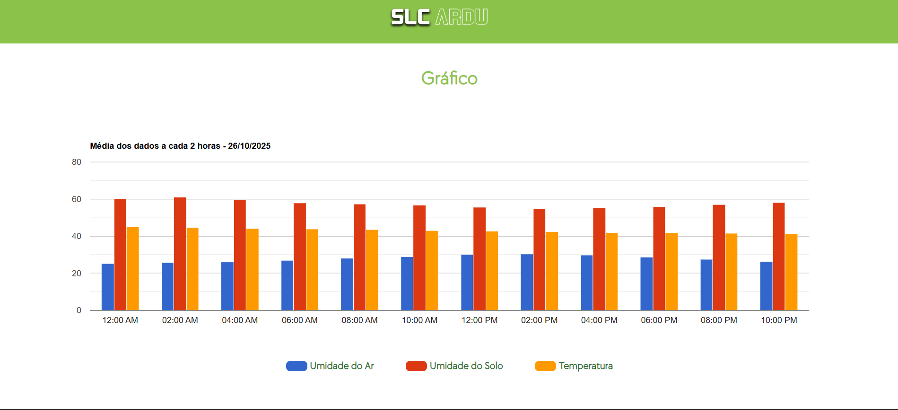
  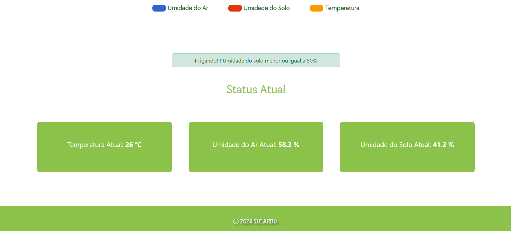

---

## 📱 Imagens do App

Aplicativo Android desenvolvido em Kotlin com WebView:

  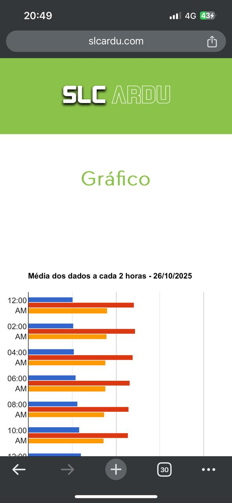
  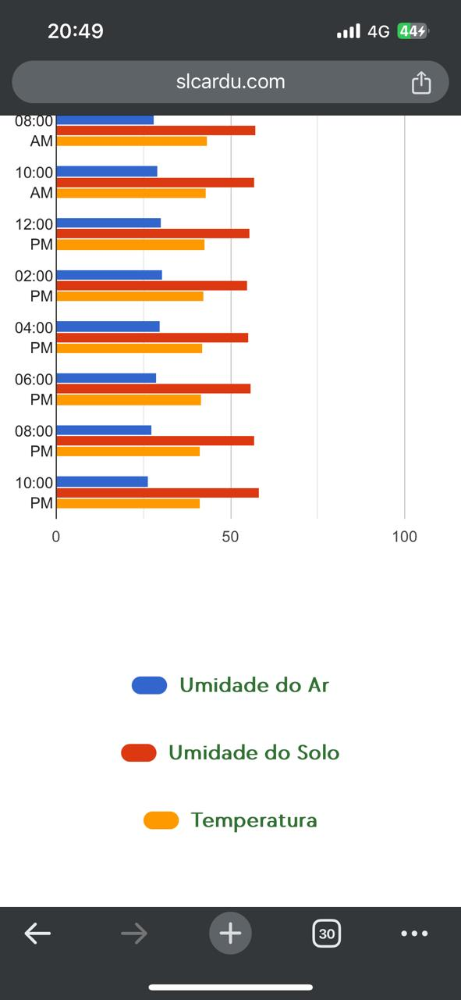

  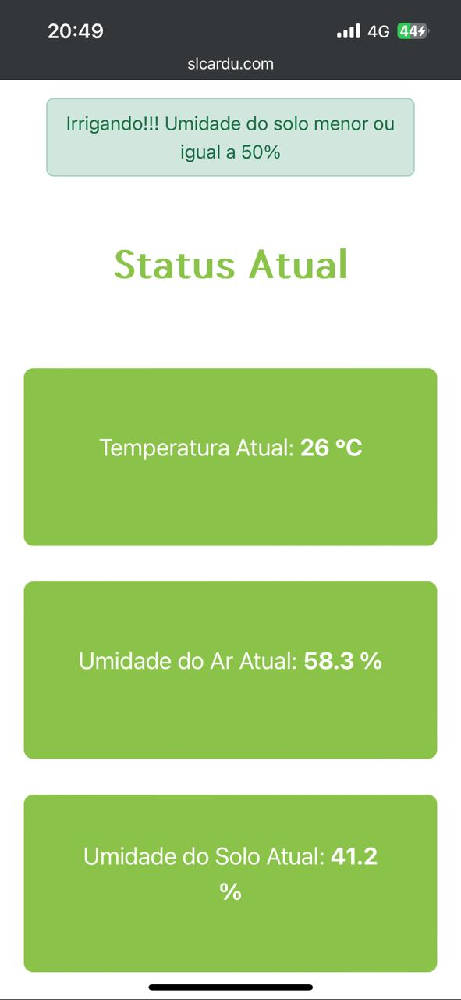
   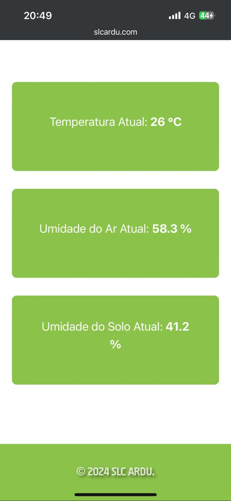

---

## 🔧 Funcionamento

Montagem do sistema físico com sensores e atuadores:

**DIA 1**  
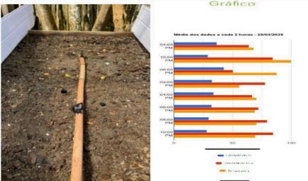

**DIA 6**  
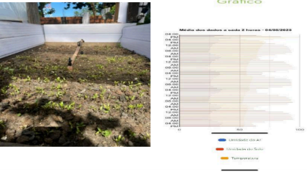

**DIA 8**  
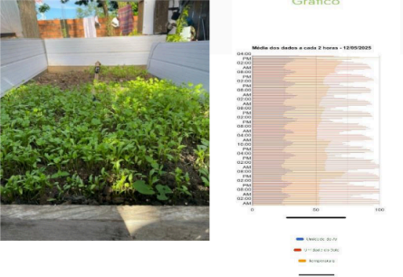
 
## 🔧 Imagens do Arduino e Montagem

Montagem do sistema físico com sensores e atuadores:

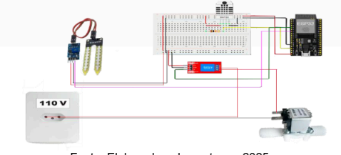

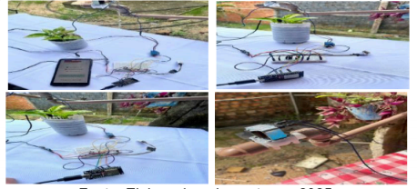

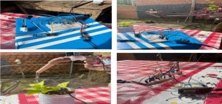

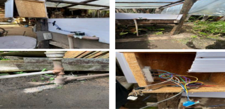

---

## 🎯 Objetivo

Desenvolver um sistema de supervisão automatizado para hortaliças que ajusta o volume de água com base nas leituras dos sensores, considerando condições climáticas locais e oferecendo monitoramento via aplicativo.

---

## ⚙️ Materiais Utilizados

- Placa Arduino ESP32  
- Sensor de umidade do solo  
- Sensor de temperatura e umidade do ar  
- Módulo relé  
- Válvula solenoide  
- Placa protoboard  
- Fios de conexão (jumpers)  
- Micro aspersor  
- Cano de PVC  
- Resistores

---

## 📊 Resultados e Eficiência

- Redução do tempo de irrigação pela metade em comparação ao método manual  
- Melhoria na saúde das plantas após 7 dias de monitoramento  
- Sistema ativado automaticamente quando a umidade do solo cai abaixo de 50%  
- Alta aceitação pelos usuários em hortas urbanas

---

## ✅ Conclusão

A automação de hortas domésticas com Arduino mostrou-se viável, sustentável e acessível. O sistema contribui para a economia de água e melhora das práticas agrícolas em pequena escala, sendo uma alternativa eficaz para ambientes urbanos.

---
## AUTOR
LUIZ FERNANDO SALES RIBEIRO

Universidade do Estado do Pará  
Centro de Ciências Naturais e Tecnologia  
Departamento de Sistemas Computacionais e Infraestrutura  
Curso de Engenharia de Software  
Baião – Setembro/2025
